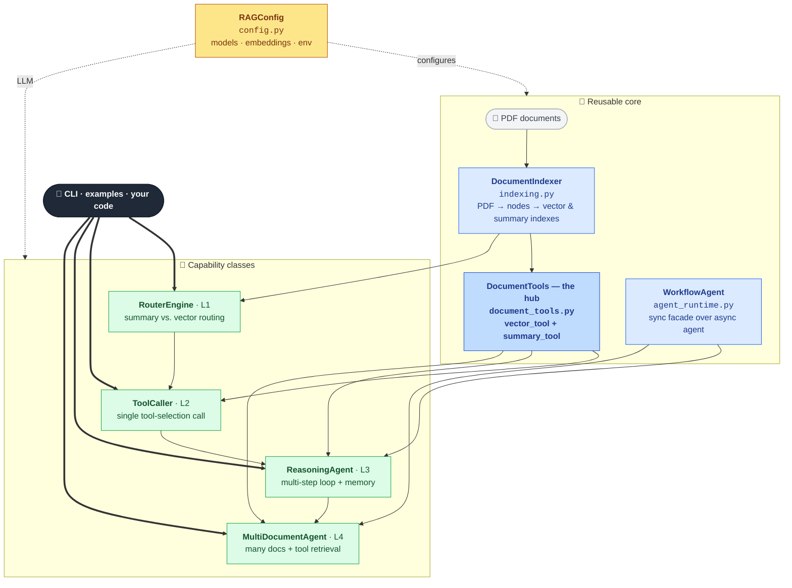

# Agentic RAG

A compact, object-oriented toolkit for building **agentic retrieval-augmented
generation** over your own PDFs, powered by [LlamaIndex](https://www.llamaindex.ai/).

It scales from a simple query router to a fully autonomous multi-document agent,
sharing one clean core of document indexing and tool construction. Point it at a
paper and ask questions; point it at a shelf of papers and let an agent decide
which ones to consult.

## Features

- **Query routing** — automatically send each question to summary-style or
  precise fact-lookup retrieval.
- **Tool calling** — expose retrieval as typed tools the LLM selects and invokes,
  including page-filtered vector search.
- **Reasoning agent** — a function-calling loop that chains tool calls,
  remembers the conversation, and streams its intermediate steps.
- **Multi-document agent** — one agent over many documents, with automatic
  *tool retrieval* so only the most relevant tools reach the model at scale.
- **One place to swap models** — provider and model live in a single config object.
- **Library + CLI** — import the classes, or drive everything from the terminal.

## Architecture

A small reusable core, with four capability classes built on top of it.



> **How to read it:** documents flow up through the core (`DocumentIndexer` →
> `DocumentTools`), `RAGConfig` feeds models to everything, and the four
> capability classes build on one another left→right (L1 → L4), all reachable
> from the CLI or your own code.

```
agentic_rag/
  config.py                RAGConfig + environment loading — the only place models are chosen
  indexing.py              DocumentIndexer: PDF → nodes → vector & summary indexes (cached)
  document_tools.py        DocumentTools: per-document (vector, summary) tool pair
  agent_runtime.py         WorkflowAgent: synchronous query/chat/stream facade over the async agent

  router_engine.py         RouterEngine        — route between summary and vector search
  tool_caller.py           ToolCaller          — single tool-selection call
  reasoning_agent.py       ReasoningAgent      — multi-step function-calling loop
  multi_document_agent.py  MultiDocumentAgent  — agent over many docs w/ tool retrieval
  cli.py                   command-line entry point
examples/                  runnable scripts for each capability
```

`DocumentTools` is the hub: it turns a document into a `(vector_tool, summary_tool)`
pair that the tool caller and both agents consume. The higher-level pieces
compose the lower ones — the reasoning agent runs a loop over document tools, and
the multi-document agent is that agent scaled across a corpus.

## Installation

```bash
pip install -r requirements.txt
```

Create a `.env` with your OpenAI key:

```bash
echo "OPENAI_API_KEY=sk-..." > .env
```

You supply the source documents. For example:

```bash
wget "https://openreview.net/pdf?id=VtmBAGCN7o" -O metagpt.pdf
```

## Quickstart

```python
from agentic_rag import RAGConfig, ReasoningAgent, load_environment

load_environment()
config = RAGConfig()            # swap model / embeddings here
config.apply_global_settings()

agent = ReasoningAgent.for_document(config.build_llm(), "metagpt.pdf", name="metagpt")
print(agent.query("What are the agent roles, and how do they communicate?"))
```

## Usage

### Route a query (summary vs. precise retrieval)

```python
from agentic_rag import RouterEngine

engine = RouterEngine("metagpt.pdf")
print(engine.query("Give me a summary of the document"))
print(engine.query("What were the ablation study results?"))
```

### Let the LLM call tools

```python
from agentic_rag import RAGConfig, ToolCaller

llm = RAGConfig().build_llm()
caller = ToolCaller.for_document(llm, "metagpt.pdf")
print(caller.call("What are the high-level results described on page 2?"))
```

### Run a reasoning agent

```python
from agentic_rag import RAGConfig, ReasoningAgent

llm = RAGConfig().build_llm()
agent = ReasoningAgent.for_document(llm, "metagpt.pdf", name="metagpt")

agent.chat("Tell me about the evaluation datasets used.")
print(agent.chat("Now give me the results on one of them."))   # remembers context

# Inspect the agent's intermediate steps
agent.run_with_events(
    "How do agents share information?",
    on_event=lambda ev: print("event:", type(ev).__name__),
)
```

### Query across many documents

```python
from agentic_rag import RAGConfig, MultiDocumentAgent

llm = RAGConfig().build_llm()
agent = MultiDocumentAgent(["metagpt.pdf", "longlora.pdf", "selfrag.pdf"], llm)
print(agent.query("Compare and contrast Self-RAG and LongLoRA"))
```

Tool retrieval turns on automatically past three documents; force it explicitly
with `MultiDocumentAgent(paths, llm, use_tool_retrieval=True)`.

## Command line

```bash
python -m agentic_rag.cli router   --file metagpt.pdf --query "Summarize the paper"
python -m agentic_rag.cli toolcall  --file metagpt.pdf --query "Results on page 8?"
python -m agentic_rag.cli agent     --file metagpt.pdf --chat
python -m agentic_rag.cli multi     --files metagpt.pdf longlora.pdf selfrag.pdf --chat
```

`--chat` (agent / multi) drops into an interactive REPL against the agent.

## Configuration

All model choices live in `RAGConfig`:

```python
RAGConfig(
    llm_model="gpt-3.5-turbo",
    embed_model="text-embedding-ada-002",
    chunk_size=1024,
    temperature=0.0,
)
```

Change these fields (or subclass) to target a different model — nothing else in
the codebase imports a provider SDK directly.

## Requirements

- Python 3.9+
- An OpenAI API key
- Dependencies in `requirements.txt` (LlamaIndex 0.14+, OpenAI LLM & embeddings)
